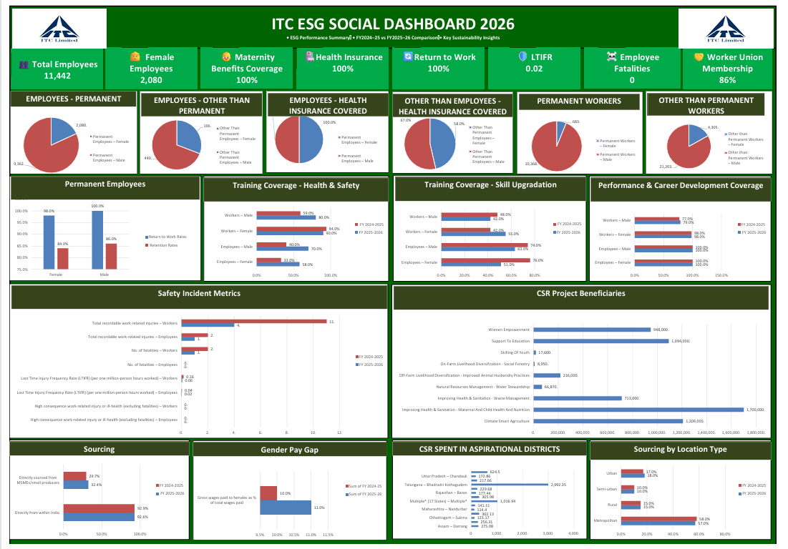

# ITC ESG Social Dashboard 2026

An end-to-end ESG data pipeline and dashboard that transforms ITC Limited's raw **BRSR (Business Responsibility & Sustainability Report) Social pillar disclosures** — extracted from the company's *Report and Accounts 2026* — into a clean, chart-ready Excel workbook and a single-page executive dashboard.



---

## 📌 Overview

Public ESG/BRSR disclosures are usually locked inside PDF tables — multi-level merged headers, inconsistent formatting, and no analysis-ready structure. This project builds a **Python ETL pipeline** that:

1. Parses 35 raw BRSR Social tables (covering **Principles 3, 4, 5, 6, and 8**)
2. Reconstructs merged/multi-level headers programmatically
3. Classifies header rows vs. data rows automatically
4. Outputs a clean, formatted Excel workbook with one readable table per disclosure
5. Generates **chart-ready pivot tables** — one self-contained table per KPI/metric, with no manual pivoting required
6. Feeds into a single-page **ESG Social Dashboard** comparing FY2024–25 vs FY2025–26 performance

---

## 📊 The Dashboard

The final dashboard (`SOCIAL DASHBOARD` sheet) summarizes ITC's social performance across:

- **Workforce composition** — Permanent vs. Other-than-Permanent Employees & Workers, by gender
- **Employee well-being** — Health insurance coverage, maternity benefits, return-to-work & retention rates
- **Training coverage** — Health & Safety and Skill Upgradation, by employee category and gender
- **Performance & career development** review coverage
- **Safety metrics** — LTIFR, recordable injuries, fatalities (Employees vs. Workers)
- **Human rights & pay equity** — Gender pay gap, minimum wage compliance
- **Sourcing** — MSME sourcing %, domestic sourcing %, by location type (Urban/Rural/Semi-urban/Metro)
- **CSR impact** — Spend across aspirational districts, and beneficiaries by program (Women Empowerment, Education, Livelihood, Health & Nutrition, Climate Smart Agriculture)

**Key headline metrics (FY2025-26):**

| Metric | Value |
|---|---|
| Total Employees | 11,442 |
| Female Employees | 2,080 |
| Health Insurance Coverage | 100% |
| Maternity Benefits Coverage | 100% |
| Return to Work Rate | 100% |
| LTIFR | 0.02 |
| Employee Fatalities | 0 |
| Worker Union Membership | 86% |

---

## 🗂 Repository Contents

| File | Description |
|---|---|
| `ITC_social_dataset.py` | Python ETL script — parses raw BRSR tables and builds the refined, chart-ready workbook |
| `ITC_Social_Dataset___Dashboard.xlsx` | Final Excel workbook — includes the dashboard, all 35 cleaned data tables, and their chart-ready pivot tables |
| `ITC_SOCIAL_DASHBOARD.png` | Static image export of the dashboard |
| `ITC_SOCIAL_DASHBOARD.pdf` | PDF export of the dashboard, for quick viewing/sharing |
| `ITC-Report-and-Accounts-2026.pdf` | Original source report (ITC Limited, public disclosure) |

---

## ⚙️ How It Works

The pipeline (`ITC_social_dataset.py`) is built with `openpyxl` and does the following for each of the 35 BRSR Social tables:

1. **`classify_rows()`** — distinguishes header rows from data rows by detecting "data-like" cells (numbers, NA/dash markers, or long free-text) vs. pure label text
2. **`fill_headers_hierarchical()`** — reconstructs multi-level merged headers (e.g. *FY → Gender → Metric*) by forward-filling each header level, resetting at group boundaries so labels don't bleed across unrelated columns
3. **`build_table_sheet()`** — renders a clean, formatted, human-readable version of each source table
4. **`build_metric_tables()` / `build_tables_sheet()`** — melts each table into **one small cross-tab per metric/KPI** (Category × Financial Year), so every table is immediately chart-ready with no pivoting needed

### Output structure per BRSR table
```
<TableName>            → Clean formatted version of the original table
<TableName>_Tables     → One mini table per metric, ready for Insert > Chart
```

---

## 🚀 Usage

```bash
pip install openpyxl

python ITC_social_dataset.py
```

Update the paths at the top of the script before running:
```python
SRC = 'path/to/ITC_Social_Dataset_2026.xlsx'          # raw extracted BRSR tables
OUT = 'path/to/ITC_Social_Dataset_2026_Refined.xlsx'  # output workbook
```

---

## 📚 Source & Scope

- **Source:** ITC Limited, *Report and Accounts 2026* (Business Responsibility & Sustainability Report — Social section)
- **Coverage:** FY 2025-26 (Current Financial Year) vs. FY 2024-25 (Previous Financial Year), as disclosed
- **BRSR Principles covered:** 3 (Employee Well-being), 4 (Stakeholder Engagement), 5 (Human Rights), 6 (Environment), 8 (Inclusive Growth / CSR)
- All figures are reproduced exactly as disclosed in the source report — no values have been estimated, altered, or recalculated.

---

## 🛠 Tech Stack

- **Python** (`openpyxl`, `re`)
- **Excel** (PivotTables, PivotCharts, dashboard layout)

---

## 📝 Note

This is a personal ESG/data analytics portfolio project built for skill demonstration purposes (data cleaning, ETL scripting, and dashboard design). All underlying data is sourced from ITC Limited's publicly available Report and Accounts 2026.
